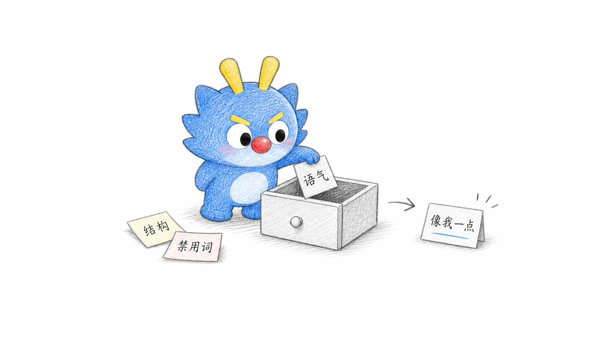
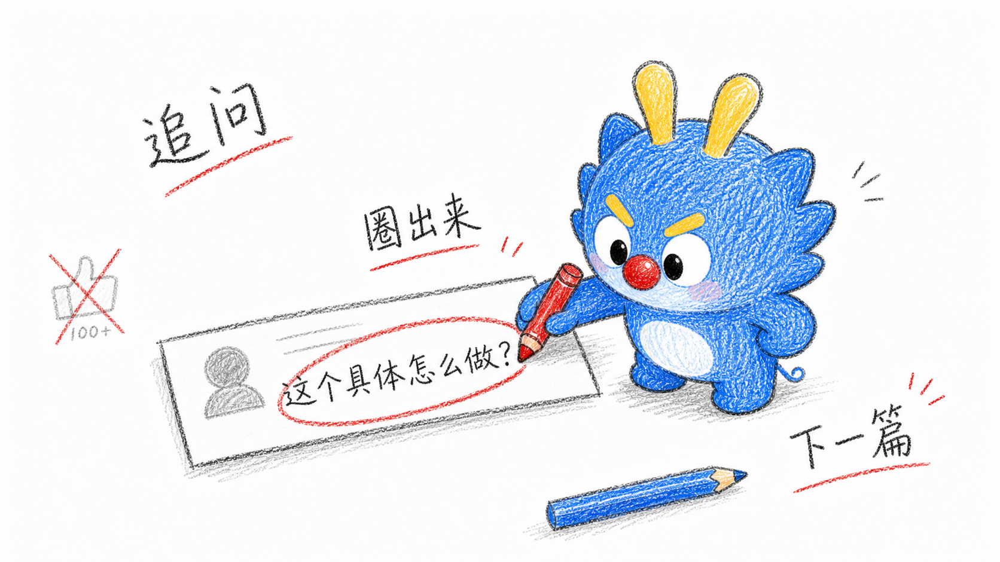
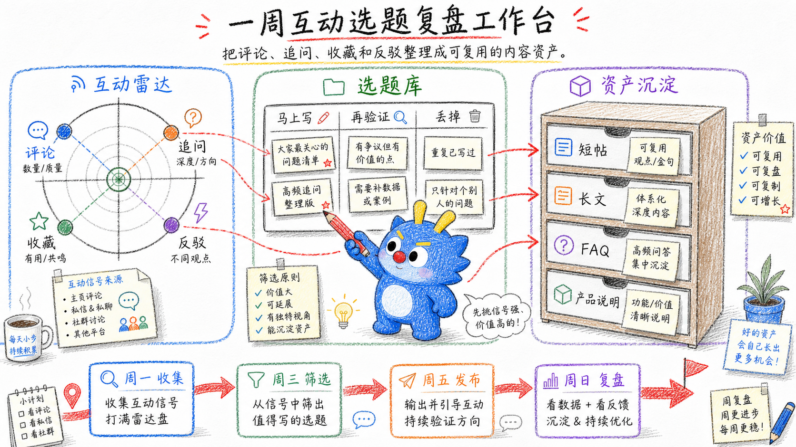
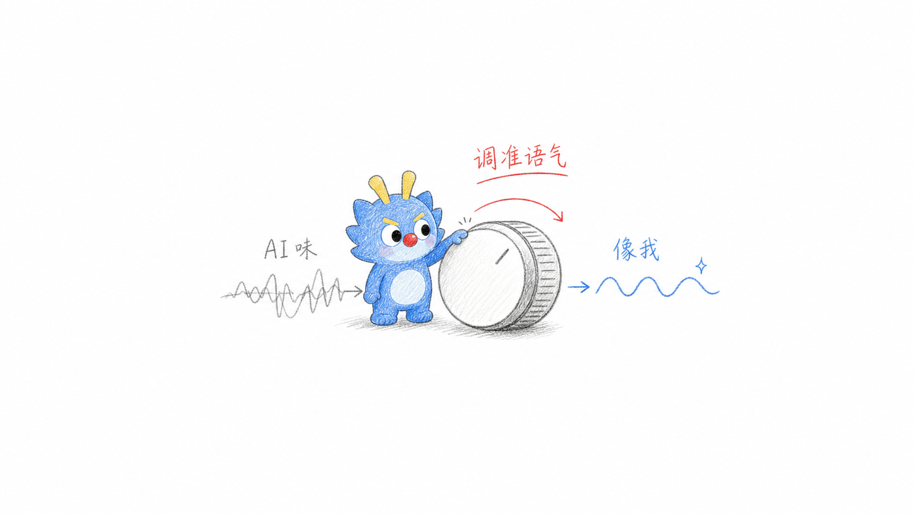
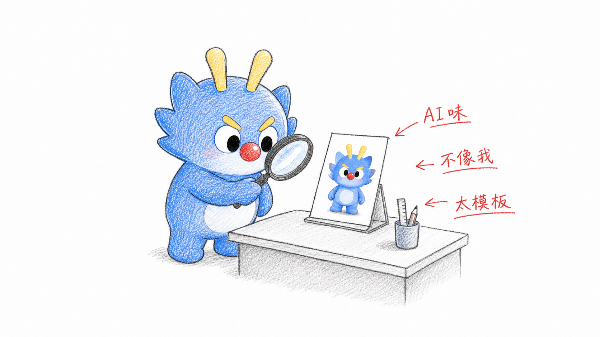
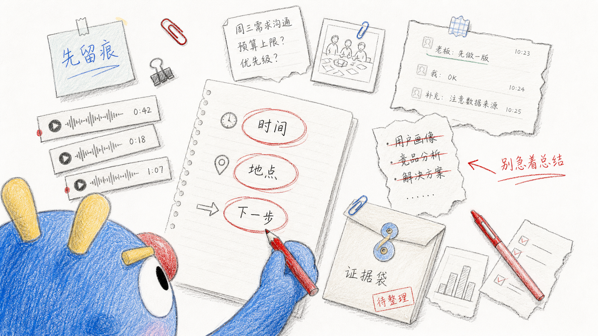

# Zhenxiaoning Human Style Lab

[简体中文](README.md) | [English](README.en.md)

**中文名：镇小宁风格实验室**

> 你不是缺一个更长的 Prompt。你缺的是一套能反复提醒 AI：什么像你、什么不像你的风格资产。

Zhenxiaoning Human Style Lab is a Codex Skill for turning a creator's own works, preferences, anti-style rules, visual subject rules, and hand-drawn illustration taste into reusable personal style assets.

## 最新更新

- **2026-06-15**：强化一句话触发体验：用户只输入一句自然短句时，Skill 会默认生成通用展示版，自动补齐文案、标题结构、配图规划、信息密度、短中文批注和图片生成流程；有生图能力时不再停在 prompt 或规划。
- **2026-06-15**：明确固定 IP 成稿与方向预览的边界：正式 IP 成稿需要参考图输入；如果当前工具只能文本生图，可先生成标注为“非最终 IP 一致性成稿”的方向预览，并通过 QA 防止画成真人、抽象人像、无角色图或普通蓝色角色。
- **2026-06-14**：新增 5 个可直接使用的工作流，让用户不必先理解完整资产包也能开始测试：
  - **新手首跑**：只问最小材料，告诉用户会生成什么、第一轮怎么验证效果。
  - **Before/After 对比**：用同一段素材同时输出默认 AI 味版本和风格资产版本，方便展示差异。
  - **风格漂移评分卡**：从像不像用户、AI 味浓度、事实可靠性、反风格命中、角色一致性等维度打分。
  - **失败样本库**：把“不像我”“太满”“角色不对”“以后不要这样”沉淀成下一次可复用规则。
  - **一键内容改造**：把文章、帖子、链接、产品说明或草稿改造成用户自己的表达，并附标题、配图规划和评分卡。
- **2026-06-14**：优化短句入口：用户只说“我要发小红书 / X / 公众号”时，默认在聊天里直接交付文案、标题、配图规划和图片结果；不再擅自写 `.md` 发布包。
- **2026-06-14**：加强视觉主体一致性：用户上传或指定角色后，连续配图必须锁定同一主体；没有角色时才使用默认示例主体，避免一组图混用多个小人。
- **2026-06-14**：新增中英文 README 入口，方便中文用户和英文用户分别查看项目说明、用法、工作流和边界。
- **2026-06-13**：加强视觉主体优先级：当前对话上传的 IP 图永远高于 `assets/references/characters/` 里的旧参考图；固定目录不再作为自动候选池，只有用户明确指定路径或 `ip-subject.md` 绑定时才读取。
- **2026-06-12**：固定角色参考目录改为“用户自有 IP 放置规范”。需要长期复用角色时，请放入自己的授权 IP 图，并在 `ip-subject.md` 绑定识别点和禁改点。
- **2026-06-12**：补齐开源维护材料：`LICENSE`、`NOTICE.md`、`CONTRIBUTING.md`、`SECURITY.md`、`CHANGELOG.md` 和 `OPENAI_CODEX_FOR_OSS_APPLICATION.md`。
- **2026-06-12**：README 顶部新增更新日志区块，后续功能升级、视觉系统变化和使用方式调整都会优先同步到这里。
- **2026-06-11**：视觉系统升级为“日常动作隐喻”：先选择找、藏、掀、夹、压、揉、撕、抖、补、贴住等生活动作，再选择载体和布局，避免配图变成搜索框、时间线、卡片或 UI 的直译。
- **2026-06-11**：GitHub 仓库描述更新为“让 AI 少一点默认味，多一点人味”，README 开头重写为更直接的项目介绍。

完整更新记录见 [`CHANGELOG.md`](CHANGELOG.md)。

## 最短用法

```text
用镇小宁风格实验室帮我做出这个 Skill 的特点和用法，我要发在小红书上。
```

它会自动推断：小红书文案、标题、轮播图规划、手绘 prompt、风格漂移评分卡。你也可以把“小红书”换成 X、公众号、视频封面或其他平台。

如果没有指定平台，它会先按通用展示版处理：介绍这个 Skill 是干什么的、能实现什么效果，并自动规划配图和图片生成流程。

如果要更精确，再补一句：

```text
风格真实一点，不要营销号；如果能生图，就直接生成配图。
```

把你的作品、偏好、角色和反风格，沉淀成一个让 AI 找回“人味”的个人风格资产 Skill。

它不是再做一个万能提示词生成器，而是把你的表达节奏、审美判断、视觉主体和内容结构变成可复用资产：后续写作、标题、脚本、配图和复盘时，AI 不再每次从零猜，也不再一出手就是默认 AI 味。

这个 Skill 从「镇小宁」这片 AI 试验田里长出来，但它沉淀的是一套通用方法：把创作者自己的作品、偏好和边界变成可复用资产。

## 它解决什么问题

很多创作者遇到的不是“AI 不会写”，而是：

- 写出来很顺，但不像自己。
- 标题、开头、总结都有明显模板感。
- 配图干净但太光滑，缺少手工痕迹。
- 个人 IP 在不同内容里不稳定。
- 每次都要重新解释自己的偏好、禁忌和表达习惯。

这个 Skill 的目标是把这些偏好沉淀成长期资产，而不是每次从零开始提示。

> 核心痛点：让 AI 记住我的风格，而不是每次都从零猜。

## 一句话看懂

把“像我一点”拆成可复用的风格证据、反风格规则、角色动作和手绘隐喻，让 AI 产出的文字和图片更像一个具体的人，而不是一个默认模型。

## 五个实用工作流

这五个入口是日常使用最容易感知价值的部分。它们的目标不是再生成一堆说明文，而是让用户马上能拿真实任务测试这个 Skill。

### 1. 新手首跑

适合刚安装、第一次打开、还不知道怎么给材料的用户。

它会先给一份最小启动清单，而不是要求用户填写复杂表单：

- 使用场景：写作、配图、标题、脚本、复盘还是平台发布。
- 作品或素材：3-10 个自有作品最好；没有作品也可以先用风格种子起步。
- 反感风格：例如 AI 味、营销号、太满、太光滑、角色不稳定。
- 是否需要角色图：短期可以直接上传，长期再放入固定目录。
- 第一轮测试任务：用一个小任务验证“像不像我”。

典型触发：

```text
请使用「镇小宁风格实验室」做一次新手首跑，告诉我最少要给什么材料，以及第一轮怎么测试。
```

### 2. Before/After 对比

适合想展示 Skill 价值、做参赛说明、给团队解释差异，或单纯想看“默认 AI 味”和“风格资产版本”有什么不同。

它会用同一段素材输出：

- 默认 AI 味版本：真实暴露常见问题，比如太顺、太泛、太像总结。
- 风格资产版本：按用户风格证据、反风格规则和内容结构重写。
- 差异说明：指出哪些词、结构、节奏、判断方式被改了。
- 可视化配图规划：用手绘图表达“去掉默认味、留下人味”的动作。
- 风格漂移评分：让结果能被讨论，而不是只说“感觉还行”。

典型触发：

```text
请使用「镇小宁风格实验室」把下面这段内容做 Before/After 对比：先给默认 AI 味版本，再给风格资产版本，并附风格漂移评分卡。
```

### 3. 风格漂移评分卡

适合每次生成后做验收，也适合用户反馈“这版像不像我”“为什么感觉不对”。

评分维度包括：

- 像不像用户：是否能指出具体风格证据。
- AI 味浓度：是否有模板腔、套话、总结腔、过度顺滑。
- 事实可靠性：是否只使用用户提供或授权信息。
- 结构贴合度：标题、开头、段落和收尾是否符合用户习惯。
- 反风格命中：是否避开禁用词、禁用句式和讨厌套路。
- 视觉主体一致性：角色是否稳定，是否参与核心动作。
- 布局新鲜度：连续配图是否重复同一种画面骨架。

输出不是简单打分，而是会给出“最该修的 3 件事”和“下一版规则”。

典型触发：

```text
请使用「镇小宁风格实验室」检查这版内容像不像我，给出风格漂移评分卡和下一版修改规则。
```

### 4. 失败样本库

适合用户明确反馈“不像我”“太 AI”“太满”“角色不对”“以后不要这样”。

它不会只重生成一版，而是把失败转成长期可复用资产：

- 记录用户反馈原话。
- 判断问题类型：事实、语气、结构、视觉主体、布局、密度、平台尺寸或合规边界。
- 写出本次漂移点。
- 新增反风格规则。
- 标注应该更新哪些资产文件。
- 给出修订后小样。

这让 Skill 越用越准：每次跑偏都不是浪费，而是下一次变稳定的材料。

典型触发：

```text
这版太像 AI 了，而且角色只是站在旁边。请使用「镇小宁风格实验室」记录失败样本，并给出下一版规则。
```

### 5. 一键内容改造

适合把文章、帖子、链接、产品说明、长对话或草稿直接变成可发布内容。

它会先区分：

- 可用事实：能保留、能引用、能改写的信息。
- 不可直接学习的部分：第三方作者的个人风格、叙事结构、标志性表达。
- 目标平台：小红书、公众号、X、视频封面、论坛、PPT 等。

然后输出：

- 改造策略。
- 改写版本。
- 标题候选。
- 配图规划。
- 图片 prompt 或直接生图结果。
- 风格漂移评分卡。
- 需要沉淀的新规则。

典型触发：

```text
请使用「镇小宁风格实验室」把这篇帖子改造成我的表达，输出改写版本、标题候选、配图规划和风格漂移评分卡。第三方内容只当观点素材，不学习原作者风格。
```

## 它不是什么

它不是通用 Skill Creator。

它不会帮你随便生成任意 Skill，而是专注于一件事：**个人风格资产**。

它会把用户自己的作品、偏好、视觉主体和反风格规则拆成结构化文件，让后续写作、标题、脚本、配图、UI 文案和内容生产都能沿着同一套风格证据继续。

## 适合谁

- 想让 AI 写作更像自己的创作者。
- 正在做个人 IP、品牌号、产品号或内容栏目的人。
- 想把“小红书 / 公众号 / B 站 / X / 社群”的表达风格统一起来的人。
- 有自己的角色形象，希望它持续参与内容表达的人。
- 想把文章、教程、产品说明做成更有手绘感、少一点 AI 味配图的人。
- 想把同一内容适配小红书、微信公众号、X、Instagram、竖屏短视频等常用自媒体尺寸的人。
- 想把一次长对话、项目迭代或 AI 实验过程整理成可发布复盘图的人。

## 核心能力

### 1. 个人风格 DNA

从用户作品里提炼：

- 语气和节奏
- 标题习惯
- 段落结构
- 判断方式
- 内容价值观
- 视觉审美
- 可验证证据和待校准假设

输出核心文件：`style-dna.md`

### 2. 反风格清单

不只写“我要什么”，也明确“我不要什么”：

- 禁用词
- 禁用句式
- 讨厌套路
- AI 味信号
- 视觉失败信号
- 内容跑偏时的修复方式

输出核心文件：`anti-style.md`

### 3. 可上手的体验闭环

不只生成资产，也能围绕真实任务运行：

- 新手首跑：先给最小材料清单和第一轮测试任务。
- 对比展示：输出默认 AI 味版本、风格资产版本和差异解释。
- 评分校准：用风格漂移评分卡指出哪里像、哪里漂。
- 失败沉淀：把用户反馈写成可复用规则。
- 内容改造：把外部素材变成用户自己的发布内容和配图规划。

输出参考文件：`references/experience-workflows.md`

### 4. 可替换视觉 IP 主体

用户可以上传自己的角色，也可以在没有角色时先从原创主体种子起步。

角色不会只是站在角落当装饰，而是参与核心动作：记录、圈出、筛选、校准、复盘、发布。

如果使用自己的 IP：

- 短期测试：直接在对话里上传角色图。
- 长期复用：把授权角色图放到 `assets/references/characters/<subject-slug>-reference.png`，并在 `ip-subject.md` 写清识别点和禁改点。
- 本机私有默认：如果你不想把某个 IP 或默认参考风格放进公开仓库，可以在本机创建 `references/ip-subject.local.md` 和 `references/style-reference.local.md`，绑定私有参考路径，并把它们排除在 GitHub 之外。

输出核心文件：`ip-subject.md`

### 5. 手绘去 AI 味配图

内置几类反 AI 味手绘方向：

- 白底彩铅草稿风
- 铅笔草图风
- 红笔批改风

这些风格不是为了模仿某个画师，而是提供一种更有手工痕迹、更适合正文配图和内容解释的视觉语言。

输出核心文件：`visual-style-seed.md`

### 6. 日常动作隐喻和自动布局

根据内容自动选择配图密度：

- 低密度：一个小局部里的生活动作，留白多，适合正文配图。
- 中密度：一个由动作驱动的粗糙小场景，适合功能说明和教程。
- 高密度：一个系统，适合方法论、复盘和课程讲义。

它也会避免连续使用相同布局，不让系列图都变成“角色站中间 + 旁边几张卡片”。

新版视觉系统不再把“信息载体”当第一决策，而是先选择日常动作隐喻：

- 找信息：从被子下面摸出皱纸条，而不是画搜索框。
- 筛需求：抖一块旧桌布，杂物落下，只剩真正有用的东西。
- 去 AI 味：把太光滑的稿纸揉皱，再贴上手写补丁。
- 平台适配：把同一张图塞进不同大小的旧相框，露出的边角不同。
- 社媒反馈：用胶带贴住吵闹红点，只让有用线索露出来。

载体库仍然保留，但只作辅助。每张图都要写清楚：日常动作隐喻、遮挡关系、露出线索、为什么不用搜索框 / 时间线 / 卡片 / UI 直译。

输出核心文件：`composition-patterns.md`

### 7. 自媒体平台尺寸适配

配图不是默认都用 16:9。Skill 会根据平台和位置选择尺寸、比例和安全区：

- 小红书图文：默认 1080 x 1440，3:4。
- 微信公众号头图：默认 900 x 383，2.35:1，并保留中心方形安全区。
- 微信公众号正文配图：默认 16:9 或 3:2。
- X 信息流：默认 1200 x 675 / 1280 x 720。
- Instagram / Facebook Feed：默认 1080 x 1350。
- 竖屏短视频 / Stories / Reels：默认 1080 x 1920。

如果同一内容要发多个平台，Skill 会优先生成横版、竖版、方版的同源多版，而不是把一张图简单裁切到所有平台。

输出核心文件：`references/platform-image-sizes.md`

### 8. 一窗实验日志

把当前窗口、一次项目迭代或长对话整理成 3-5 张手绘实验日志图。

它不会截图聊天记录，而是提炼：

- 起因
- 卡点
- 关键选择
- 打磨动作
- 当前结果
- 下一步

输出参考：`references/window-experiment-log.md`

## 效果展示

### 风格资产：把“像我一点”拆成可复用部件



### 低密度：正文里轻轻出现，有呼吸感



### 高密度：把复杂方法论整理成工作台



### 载体变化：不总是纸片、文件夹和卡片



### 一窗实验日志：把一次迭代变成可发布复盘图



### 风格回归：诊断 AI 味，再修回用户自己的表达



## 快速开始

把这个仓库作为 Skill 导入到支持 Skill 的环境中，或下载仓库后把整个文件夹放进你的 Skills 目录。

然后用下面的方式触发：

```text
请使用「镇小宁风格实验室」，基于下面这些作品生成我的个人风格资产。

使用场景：小红书图文 + 公众号长文 + 产品介绍
目标：让后续写作和配图更像我，少一点 AI 味
反感风格：不要营销号标题、不要过度总结、不要光滑商业插画
视觉主体：使用我上传的角色
作品材料：……
```

也可以直接使用更轻量的入口：

```text
请使用「镇小宁风格实验室」做一次新手首跑，告诉我最少要给什么材料，以及第一轮怎么测试。
```

```text
请使用「镇小宁风格实验室」把下面这段内容做 Before/After 对比：先给默认 AI 味版本，再给风格资产版本，并附风格漂移评分卡。
```

```text
请使用「镇小宁风格实验室」把这篇帖子改造成我的表达，输出改写版本、标题候选、配图规划和风格漂移评分卡。第三方内容只当观点素材，不学习原作者风格。
```

## 用户角色参考图

如果你要让一个角色在连续配图里保持稳定，不需要一开始就改仓库。短期任务可以直接上传角色图；如果要长期复用，再把授权角色图放到：

```text
assets/references/characters/<subject-slug>-reference.png
```

然后在 `ip-subject.md` 写清：

- 参考图路径
- 来源授权
- 识别点
- 禁改点
- 动作库
- 常见道具
- 连续配图一致性规则

优先级要注意：当前对话上传的角色图永远最高。如果目录里残留了旧角色图，Agent 不应该自动读取；只有用户明确指定路径，或 `ip-subject.md` 明确绑定当前角色和该路径时，固定目录里的图片才生效。

## 三种常见用法

### 方式一：已有作品模式

适合已经有 3-10 个自有作品的人。

```text
我会给你 5 篇自己的文章和 3 张旧配图。
请使用「镇小宁风格实验室」提炼我的 style-dna、anti-style、content-patterns、visual-style-seed 和 qa-checklist。
每个关键判断都要标注证据，不确定的部分放进待校准假设。
```

### 方式二：空白起步模式

适合还没有稳定作品，但想先搭一版风格资产的人。

```text
我还没有成熟作品。
请使用「镇小宁风格实验室」从空白起步，先给我 1-2 个原创风格种子，再生成第一版个人风格资产。
注意：这些只能写成待校准假设，不要冒充我的真实风格。
```

### 方式三：反风格起步模式

适合只知道自己不喜欢什么的人。

```text
我讨厌 AI 味、套话、标题党、太光滑的商业插画和一看就是模板的总结。
请使用「镇小宁风格实验室」先生成 anti-style.md，再反推出可测试的正向风格方向。
```

## 配图使用示例

如果你已经有自己的角色图：

```text
请使用我上传的角色作为固定视觉主体，为这篇文章生成 5 张连续正文配图。

要求：
- 手绘去 AI 味
- 默认白底彩铅草稿风
- 目标平台：小红书图文轮播
- 推荐尺寸：1080 x 1440
- 自动判断低 / 中 / 高密度
- 优先使用日常动作隐喻，不要默认画卡片、时间线或 UI
- 每张图的布局不要重复
- 角色必须参与核心动作，不要只站在角落
- 先输出平台尺寸计划和布局规划表，再生成图片或图片 prompt
```

多平台适配示例：

```text
请使用「镇小宁风格实验室」，把这篇文章做成 3 套同源配图：
1. 公众号正文横图：16:9
2. 小红书轮播竖图：1080 x 1440
3. 社群分享方图：1080 x 1080

不要直接裁切同一张图，每个尺寸都要重排构图，并标注安全区。
```

如果当前环境不能直接生成图片，Skill 会先说明限制，再输出布局方案和可复制到生图工具里的 prompt。

## 项目结构

```text
.
├── SKILL.md
├── README.md
├── README.en.md
├── LICENSE
├── NOTICE.md
├── CONTRIBUTING.md
├── SECURITY.md
├── CHANGELOG.md
├── OPENAI_CODEX_FOR_OSS_APPLICATION.md
├── references/
│   ├── intake-and-modes.md
│   ├── style-dna-schema.md
│   ├── skill-pack-template.md
│   ├── ai-flavor-recovery-system.md
│   ├── visual-ip-system.md
│   ├── handdrawn-style-seeds.md
│   ├── layout-selection-engine.md
│   ├── presentation-carriers.md
│   ├── platform-image-sizes.md
│   ├── window-experiment-log.md
│   ├── experience-workflows.md
│   ├── model-runtime-requirements.md
│   ├── qa-checklist.md
│   └── compliance-boundaries.md
├── examples/
│   ├── blank-start-example.md
│   ├── existing-works-example.md
│   ├── on-brand.md
│   └── off-brand.md
└── assets/
    ├── references/
    │   └── characters/
    │       ├── README.md
    │       └── <subject-slug>-reference.png
    ├── examples/
    └── showcase/
```

## 输出文件说明

这个 Skill 常见会为用户生成一组个人风格资产：

| 文件 | 用途 |
| --- | --- |
| `style-dna.md` | 定义用户表达方式、审美、结构和判断习惯 |
| `anti-style.md` | 记录不能出现的 AI 味、套路和视觉失败信号 |
| `content-patterns.md` | 沉淀标题、开头、段落、脚本和配图结构 |
| `experience-workflows.md` | 定义首跑、对比、评分、失败样本和一键改造工作流 |
| `visual-style-seed.md` | 定义手绘风格、留白、密度和视觉语言 |
| `ip-subject.md` | 定义用户角色或原创主体的识别点 |
| `composition-patterns.md` | 定义布局选择、密度档位和避重规则 |
| `platform-image-sizes.md` | 定义小红书、微信公众号、X、Instagram 等平台尺寸、比例、安全区和重排规则 |
| `prompt-template.md` | 后续复用的写作、标题、脚本和配图提示词 |
| `qa-checklist.md` | 检查输出是否像用户、哪里漂移 |
| `ai-flavor-diagnostics.md` | 诊断默认 AI 味并给出修复方向 |
| `style-evolution-log.md` | 记录长期校准后的风格变化 |

## 开源维护

这个项目是一个早期开源 Skill，不是成熟框架。当前更适合用真实任务继续打磨规则和案例。

- 贡献说明：`CONTRIBUTING.md`
- 安全说明：`SECURITY.md`
- 变更记录：`CHANGELOG.md`
- 许可：`LICENSE`
- 项目边界和 IP 注意事项：`NOTICE.md`
- Codex for OSS 申请文案：`OPENAI_CODEX_FOR_OSS_APPLICATION.md`

最欢迎的贡献是可复现的失败样本：例如主体漂移、AI 味回潮、布局重复、平台尺寸错位、低密度画成复杂场景、或第三方风格边界不清。

## 合规边界

这个 Skill 默认只处理：

- 用户自己的作品。
- 用户明确授权的品牌或项目资料。
- 抽象风格方向，例如“更克制、更纪实、更少营销感”。

它不用于复刻名人、在世创作者、博主、画师、设计师等可识别个人风格，也不用于伪装成别人发言。

如果用户要求模仿第三方，应该改写为抽象方向，例如“更短句、更纪实、更少营销感”，而不是复制某个人。

## 一句话介绍

把你的作品、偏好、反风格和视觉主体沉淀成可复用的个人风格资产，让 AI 后续生成内容时更稳定地像你自己，也更有人的手感。
